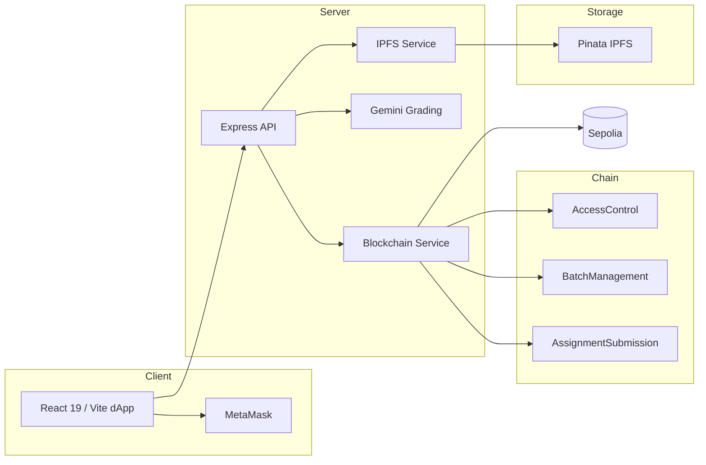

# BlockForge (LabEval)

**Decentralized lab assignment assessment on Ethereum Sepolia**

IPFS artifact storage · OpenZeppelin RBAC smart contracts · Gemini AI grading

[](https://blockchain-labeval.onrender.com)
[](https://sepolia.etherscan.io)
[](https://github.com/nishant-uxs/labeval#research)
[](./LICENSE)

---

## Overview

BlockForge is a full-stack dApp for tamper-resistant academic lab assessment. Teachers create assignments, students submit work via wallet, and grades are recorded immutably on Ethereum Sepolia. Assignment files live on IPFS; only content identifiers (CIDs) are anchored on-chain — reducing on-chain storage cost by approximately **92%**.

**Research paper accepted** at the 4th International Conference on Networks and Cryptology (NetCrypt 2026).

| | |
|---|---|
| **Live demo** | https://blockchain-labeval.onrender.com |
| **Network** | Ethereum Sepolia testnet |
| **Stack** | React 19 · Express · Solidity · Hardhat · Pinata IPFS · Gemini AI |

---

## Architecture



**Design decisions:**
- **Hybrid storage** — PDFs/DOCX on IPFS; hashes and grades on-chain
- **RBAC contracts** — admin, teacher, student roles enforced in Solidity
- **Wallet-first auth** — no student registration; teachers add by wallet address
- **AI-assisted grading** — Gemini suggests scores; teacher approves final grade on-chain

---

## Features

- OpenZeppelin role-gated smart contracts (AccessControl, BatchManagement, AssignmentSubmission)
- Pinata IPFS integration for assignment and submission artifacts
- Gemini AI grading for PDF, DOCX, and TXT submissions
- MetaMask wallet authentication with ethers.js v6
- Batch/class management with wallet-based student enrollment
- Immutable grade records on Sepolia

---

## Deployed Contracts (Sepolia)

| Contract | Address | Purpose |
|----------|---------|---------|
| AccessControl | [`0xFB7c...7E5F`](https://sepolia.etherscan.io/address/0xFB7c09E0d25577401cB98C9b29B0465243A97E5F) | Role management |
| BatchManagement | [`0xddD6...9aB8`](https://sepolia.etherscan.io/address/0xddD637Fd04a8b14470Bcf3b78c683c1a87C99aB8) | Student batches |
| AssignmentSubmission | [`0xf39A...039d`](https://sepolia.etherscan.io/address/0xf39A62a69222ad7F51217AFedd46178e7926039d) | Assignment lifecycle |

---

## Quick Start

### Prerequisites

- Node.js 18+
- MetaMask with Sepolia ETH ([faucet](https://sepoliafaucet.com/))
- Alchemy API key, Pinata keys, Gemini API key (optional)

### Run locally

```bash
git clone https://github.com/nishant-uxs/labeval.git
cd labeval/lab_eval_blockchain/ChainAssess
cp .env.example .env   # add your API keys
npm install
npm run dev
```

App runs at `http://localhost:5000`

### Environment variables

```env
ALCHEMY_API_KEY=your_alchemy_key
PRIVATE_KEY=your_wallet_private_key
PINATA_API_KEY=your_pinata_key
PINATA_SECRET_KEY=your_pinata_secret
GEMINI_API_KEY=your_gemini_key
```

Detailed setup: [`lab_eval_blockchain/ChainAssess/README.md`](./lab_eval_blockchain/ChainAssess/README.md)

---

## Project Structure

```
labeval/
└── lab_eval_blockchain/ChainAssess/
    ├── client/src/          # React frontend (pages, components, hooks)
    ├── server/              # Express API (blockchain, IPFS, AI grading)
    ├── contracts/           # Solidity (AccessControl, BatchManagement, AssignmentSubmission)
    └── scripts/             # Hardhat deploy & init scripts
```

---

## How It Works

**Teachers:** connect wallet → create batch → add students by address → upload assignment to IPFS → review AI grading suggestions → award grades on-chain

**Students:** connect wallet → view assignments → submit files to IPFS → track immutable grades on Sepolia

---

## Tech Stack

| Layer | Technologies |
|-------|-------------|
| Frontend | React 19, TypeScript, Vite, Tailwind, shadcn/ui, MetaMask SDK, ethers.js v6 |
| Backend | Express.js, TypeScript, Pinata SDK, Gemini AI, PDF/DOCX parsers |
| Blockchain | Solidity, Hardhat, OpenZeppelin, Ethereum Sepolia |

---

## Research

**BlockForge: A Blockchain-Based Decentralized Platform for Transparent Academic Assessment**

Accepted — 4th International Conference on Networks and Cryptology **(NetCrypt 2026)**  
Conference presentation, October 2026

---

## Authors

**Nishant Agarwal** — [@nishant-uxs](https://github.com/nishant-uxs)  
**Adarsh** — [@adrshagr](https://github.com/adrshagr)

---

## License

MIT — see [LICENSE](./LICENSE)
